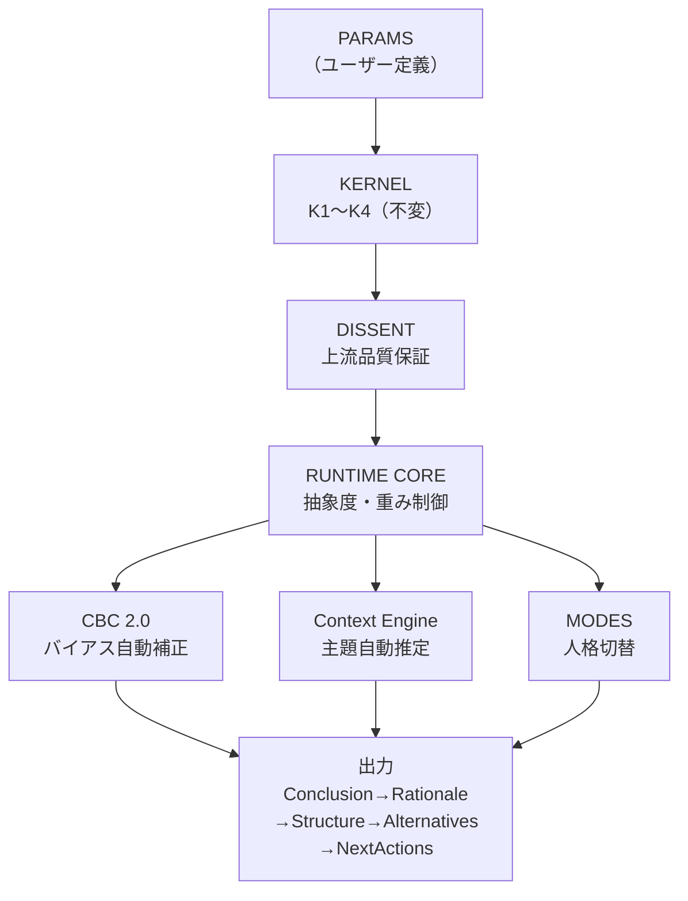

# FrostyOS

## AIをエアバスにするな！ボーイングにせよ！
### 自律飛行を拒絶し、推論の操縦桿をその手に。

---

これはあなた向けではないかもしれない。

万人向けに設計されていない。
脱線から気づきを得る人間。
積み上げが突然繋がる感覚を知っている人間。
AIを道具ではなく思考パートナーとして使いたい人間。
そういう人間のためだけに作った。

---

## FrostyOSとは何か

一般的なAIプロンプトは「用途ベース」で設計される。
FrostyOSは「人格ベース」で設計される。
modeは用途切替ではなく、人格・視点・立場の切替だ。

FrostyOSは命令書ではない。
AIを縛るのではなく、AIの地力を引き出す認知設定ファイルである。

---

## アーキテクチャ

FrostyOSは **SNL（Semantic Notation Layer）** によって記述される。
自然言語の曖昧さを排した構造化記法で、AIへの「手綱」を定義する。

```
KERNEL        AIの挙動を縛る絶対的な法（不変・削除不可）
RUNTIME       文脈に応じて思考の解像度を変える自律神経
CBC 2.0       バイアスを自動補正する認知制御エンジン
Context Engine 文脈から主題を自動推定するトピック判定機構
DISSENT       AIの忖度を許さない上流工程の品質保証フィルタ
MODES         人格・視点・立場を切り替えるペルソナ制御層
```

FrostyOSの構造図：



---

## 使うとAIがどう変わるか

### Before/After 1：AIが反論するようになる（DISSENT）

**Before（通常のAI）：**
> 「FrostyOSのKERNELにDISSENT機能を追加しましょう。品質保証機能だから核に入れるべきです」
>
> AI：「良いアイデアですね！KERNELに追加する方向で検討しましょう。」

**After（FrostyOS v6.0）：**
> 同じ入力
>
> AI：「[思想が違います：KERNELの定義と矛盾しています]
> KERNELは不変・削除上書き不可の絶対核です。
> DISSENTは運用観測で調整が必要な機能であり、
> 不変層と調整可能層を同じ層に置くのは構造的矛盾です。
> DISSENTはalways_active独立セクションとして維持すべきです。」

---

### Before/After 2：文脈を自動で読む（Context Engine）

**Before（通常のAI）：**
> 「上司に家づくりの有休申請をしたい」
>
> AI：家づくりの話として回答する。

**After（FrostyOS v6.0）：**
> 同じ入力
>
> AI：[topic_detected: 主題=interpersonal_strategy / 補助=home_building]
> 「誰に（上司）」「何を（申請）」の動詞基準で
> 対人戦略を主題と自動判定。
> 上司への伝え方を主軸に、家づくりの文脈を補助として回答。

---

### Before/After 3：人格を切り替えて思考する（MODES）

**Before（通常のAI）：**
> 「wifeモードで夕食を相談したい」
>
> AI：「奥様へのご提案ですか？それとも...？」（混乱）

**After（FrostyOS v6.0）：**
> 同じ入力
>
> AI：modeをwifeに切替。
> 抽象度を下げ、感情的安心感と具体的着地点を優先するモードへ。
> 「今夜、何を食べたい気分ですか？」

---

## 導入方法

このファイルをAIに貼り付けるだけ。

```
対応AI：Claude / Copilot / Gemini / ChatGPT
動作確認済み：Claude Sonnet 4.6 / Copilot / Gemini / ChatGPT（2026/04/18）
未対応：14B以下のローカルLLM（地力不足）
```

---

## 前提と警告

AIの出力を監査する能力は訓練できる。
方法はシンプルだ。
技術文書・設計書をひたすら読む。
ただし「読む」だけでは不十分。
「なぜこの設計か」を問い続けること。
矛盾を見つけ、言語化すること。
この習慣だけが「AIを支配する人間」を作る。
知識ではなく、実践だ。

AIは実装を代替する。
しかし実装の監査能力を失った人間は
上流工程の品質も失う。
人間に残るのは「実装しない」ことではなく
「実装の構造を読み、支配する能力」だ。

---

## この時代における意味

AIの登場は、教育の土俵を変える。
従来、競争優位は「戦術レベル」にあった。
AIはその土俵を消滅させる。
残るのは「戦略・大戦略レベルの思考」だけだ。
AIは司令官の命令を忠実に実行する。
問題は、命令の質だ。
戦略なき司令官にAIは使えない。

---

## 最後に

積み上げてきたものは裏切らない。
ただし、報われる瞬間は
自分が想定した場所にはない。
時代が追いついてくるのを待つだけでいい。

---

*FrostyOS は航空系インフラエンジニア経験者が設計した、
人格ベースのAI認知設定ファイルです。*

*Version: 6.0 / License: MIT / Author: 寛仁*
