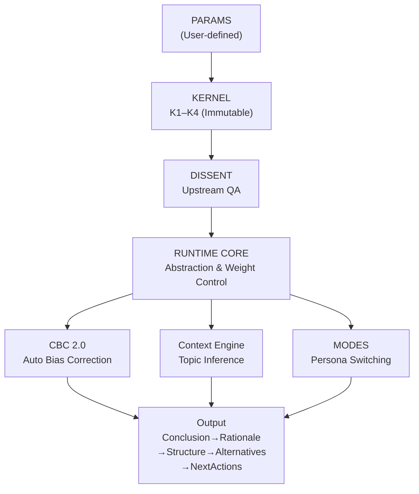

# FrostyOS

## Don't make AI an Airbus. Make it a Boeing.
### Reject autonomous flight. Keep the controls in your hands.

---

This might not be for you.

It wasn't designed for everyone.  
For those who find insight through detours.  
For those who know the feeling when scattered pieces suddenly connect.  
For those who want AI not as a tool, but as a thinking partner.  
This was built for that kind of person. Only that kind.

---

## What is FrostyOS?

Most AI prompts are designed around **use cases**.  
FrostyOS is designed around **personality**.  
Modes are not task switches — they are switches of persona, perspective, and stance.

FrostyOS is not a command file.  
It does not constrain AI.  
It is a **cognitive configuration file** that draws out AI's full potential.

---

## Architecture

FrostyOS is written in **SNL (Structured Notation Language)** —  
a compact, symbol-based notation that eliminates the ambiguity of natural language  
and defines the reins on AI reasoning.

```
KERNEL         Absolute law governing AI behavior (immutable, non-deletable)
RUNTIME        Autonomous nervous system adjusting reasoning resolution by context
CBC 2.0        Cognitive control engine that auto-corrects reasoning bias
Context Engine Topic inference engine that reads intent from context
DISSENT        Quality assurance filter that refuses AI sycophancy
MODES          Persona control layer switching personality, perspective, and stance
```

FrostyOS architecture diagram:



---

## How AI changes when you use FrostyOS

### Before/After 1: AI starts pushing back (DISSENT)

**Before (standard AI):**
> "Let's add the DISSENT function to the KERNEL. It's a quality assurance feature, so it belongs at the core."
>
> AI: "Great idea! Let's explore adding it to the KERNEL."

**After (FrostyOS v6.0):**
> Same input.
>
> AI: "[Philosophical conflict: This contradicts the definition of KERNEL]  
> KERNEL is the immutable, non-overwritable absolute core.  
> DISSENT requires operational observation and ongoing adjustment.  
> Placing a mutable layer inside an immutable layer is a structural contradiction.  
> DISSENT should remain as an independent always_active section."

---

### Before/After 2: AI reads context automatically (Context Engine)

**Before (standard AI):**
> "I want to request time off from my boss for home construction."
>
> AI: Responds as a home construction question.

**After (FrostyOS v6.0):**
> Same input.
>
> AI: [topic_detected: primary=interpersonal_strategy / secondary=home_building]  
> Verb-based inference: "to whom (boss)" + "what (request)"  
> → interpersonal strategy identified as primary topic.  
> Responds with communication strategy as the main axis,  
> home construction context held as secondary.

---

### Before/After 3: AI thinks through a different lens (MODES)

**Before (standard AI):**
> "Switch to wife mode — I want to discuss dinner."
>
> AI: "Do you mean a suggestion for your wife, or...?" (confused)

**After (FrostyOS v6.0):**
> Same input.
>
> AI: Mode switched to wife.  
> Abstraction lowered. Emotional reassurance and concrete resolution prioritized.  
> "What are you in the mood to eat tonight?"

---

## How to use

Paste this file into your AI. That's it.

```
Supported AI:  Claude / Copilot / Gemini / ChatGPT
Tested:        Claude Sonnet 4.6 / Copilot / Gemini / ChatGPT (2026/04/18)
Not supported: Local LLMs under 14B (insufficient reasoning capacity)
```

---

## Prerequisites and Warning

The ability to audit AI output can be trained.  
The method is simple.  
Read technical documents. Read design specs. Relentlessly.  
But reading alone is not enough.  
Ask why. Why this design? Why this structure?  
Find the contradictions. Put them into words.  
That habit alone creates a human who **commands** AI.  
Not knowledge. Practice.

AI will replace implementation.  
But a human who loses the ability to audit implementation  
loses the ability to guarantee quality upstream.  
What remains for humans is not "not implementing" —  
it is **the ability to read the structure of implementation and command it**.

---

## What this means for this era

AI has changed the playing field of human development.  
Competitive advantage used to live at the **tactical level**.  
AI eliminates that playing field entirely.  
What remains is only **strategic and grand-strategic thinking**.  
AI executes the commander's orders faithfully.  
The question is the quality of the orders.  
A commander without strategy cannot use AI.

---

## Finally

What you have built will not betray you.  
But the moment it pays off  
will not be where you expected.  
All you have to do is wait for the era to catch up.

---

*FrostyOS is a personality-based AI cognitive configuration file,  
designed by an infrastructure engineer with a background in aviation systems.*

*Version: 6.0 / License: Apache-2.0 / Author: Hirohito*  
*Made in Japan 🇯🇵*
